## 在SAP Cloud Platform（SCP)获取免费测试账户
在SCP中注册账户登陆
### 1.登陆SAP Cloud Trial官网注册 
登入SAP Cloud Platform Cockpit（https://account.hanatrial.ondemand.com/cockpit/） 点击注册，网页指向SAP官网（https://www.sap.com）
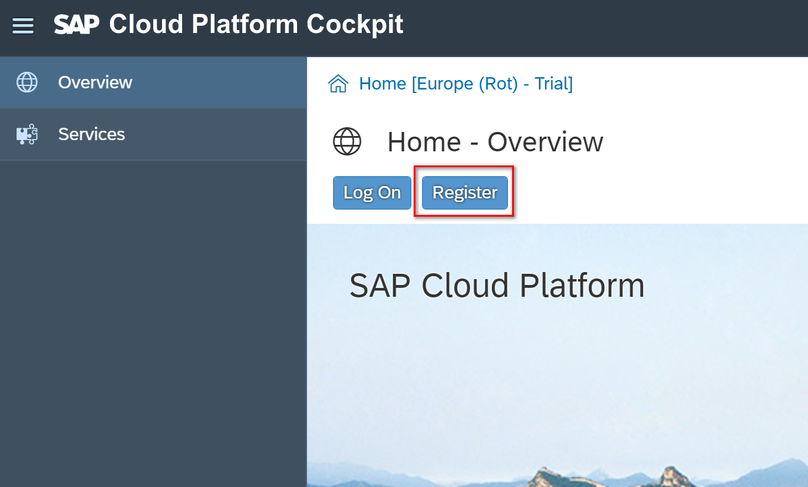
在官网的右上角，点击人型icon,进行注册  
    
如果您在www.sap.com上有帐户（例如S，C，D或I号码），您可以输入密码或相关电子邮件以及密码。 如果您还没有帐户，可以选择其他登录方法之一，或单击“注册”以创建帐户。
如果您不需要在sap.com上注册，则可以跳到步骤4.确保完成所有步骤以完成本教程。

### 2. 在sap.com上注册
如果在上一步中单击了“注册”，则会看到“注册”对话框。 填写必填字段，然后单击“注册”。
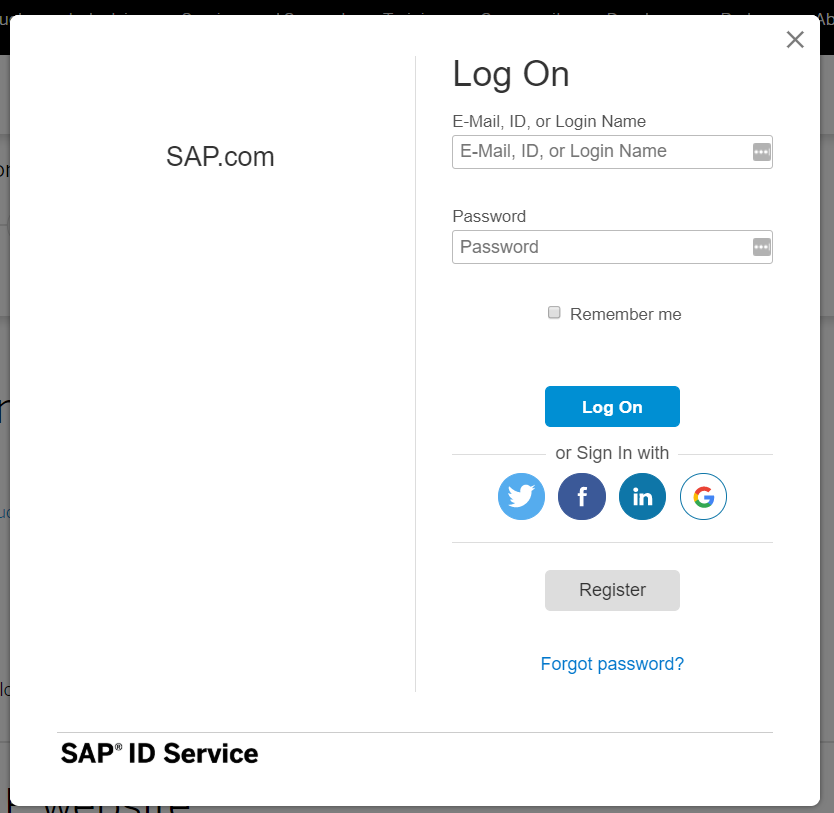    
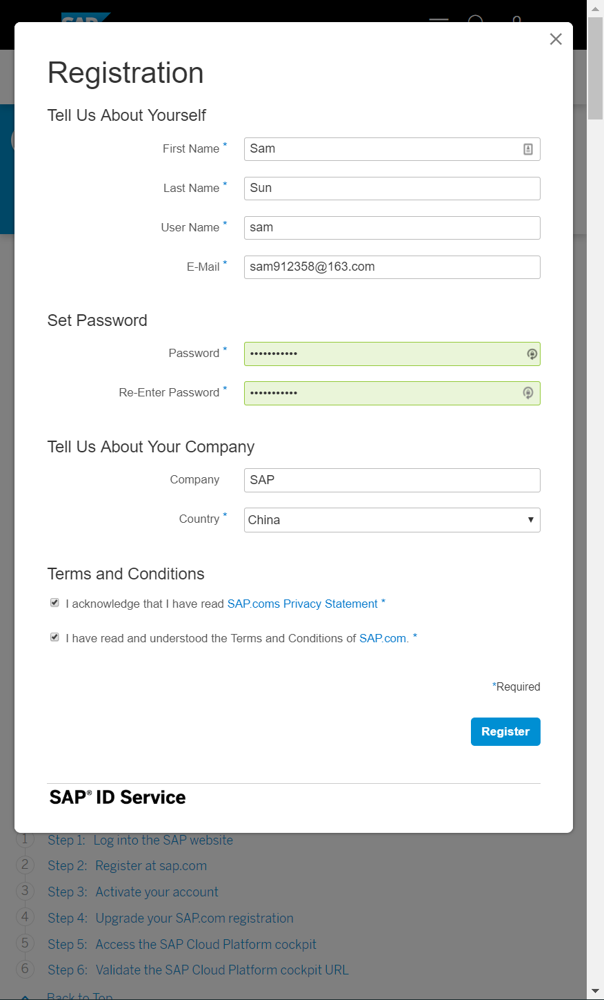    
注意记住你注册的信息，在接下里登陆的时候需要使用。
您将收到一条消息，表明已向您发送激活链接。  
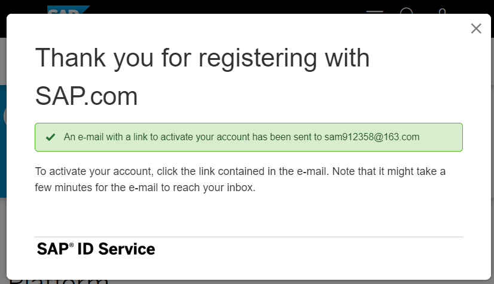    

### 3.激活你的账号
去邮箱里中点击链接，激活你的账号，之后登陆sap.com，就可以在个人信息栏里面看到，注册成功。
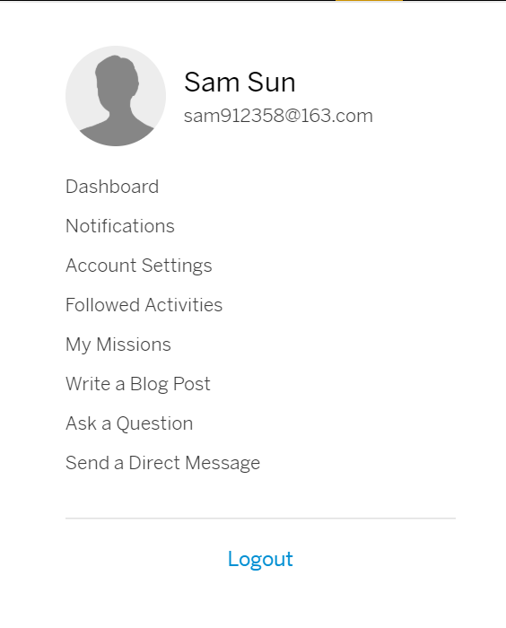    

### 4.访问你的SAP Cloud Platform cockpit 
在浏览器中访问 https://account.hanatrial.ondemand.com/cockpit/，输入用户名和密码，登陆cockpit。
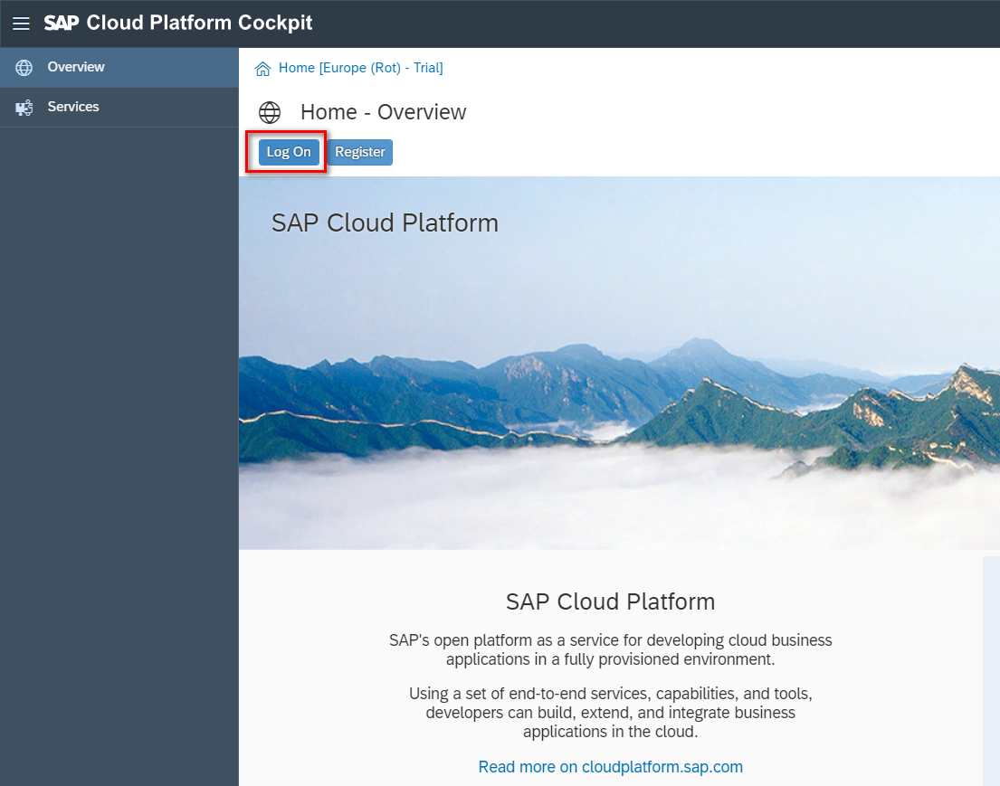
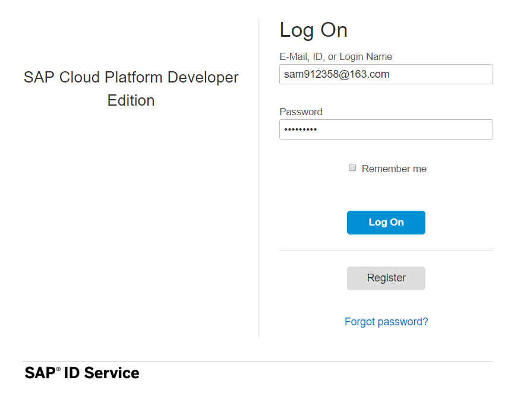   
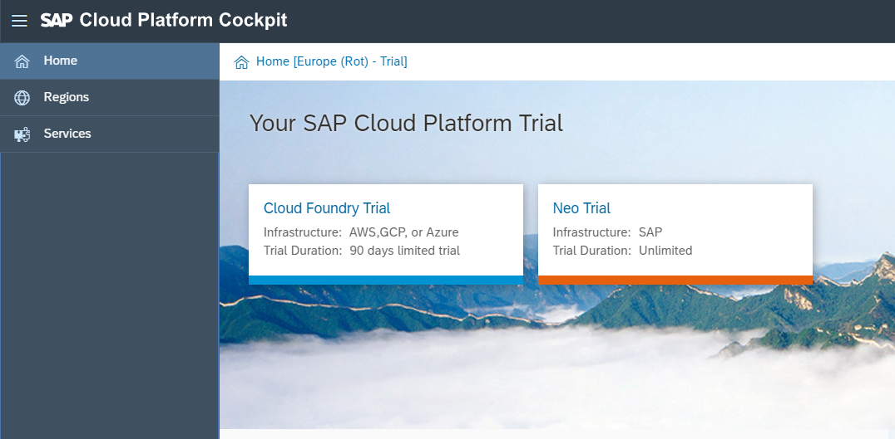    

### 5. 申请Cloud Foundry账户
点击Cloud Foundry Trial,申请CF的账户。在申请账户的时候需要认证手机号码。
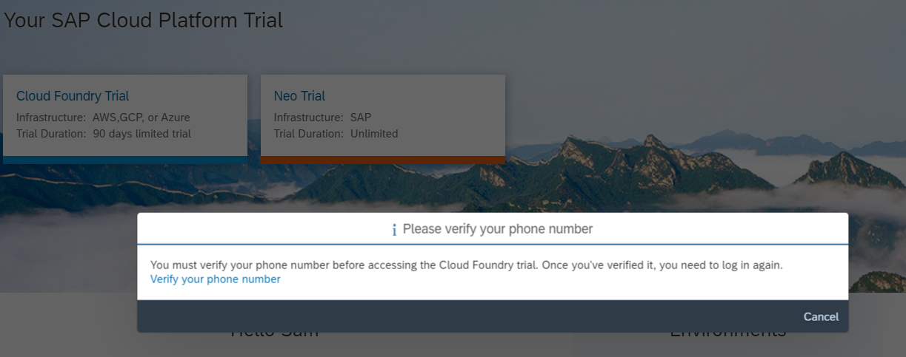    
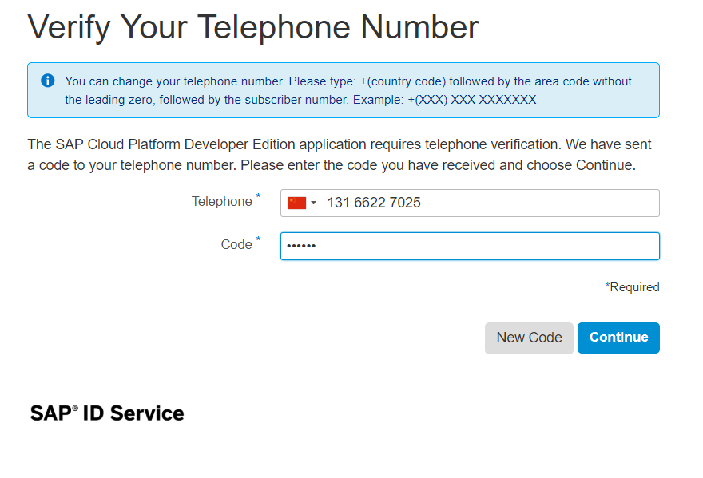    

验证成功之后，再次登录系统创建Cloud Foundry的账户。
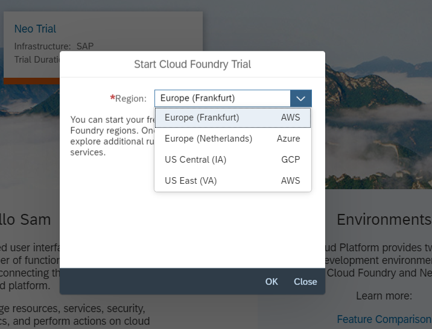    
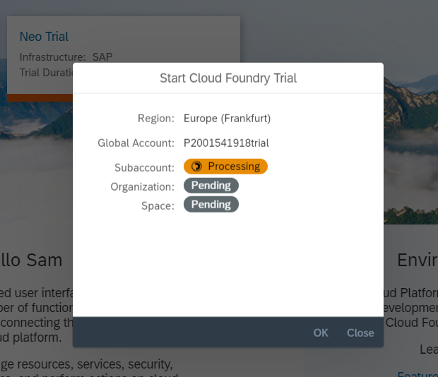

在创建过程之后会出错，提示创建子账户问题。不用担心，我们之后手动创建子账户。
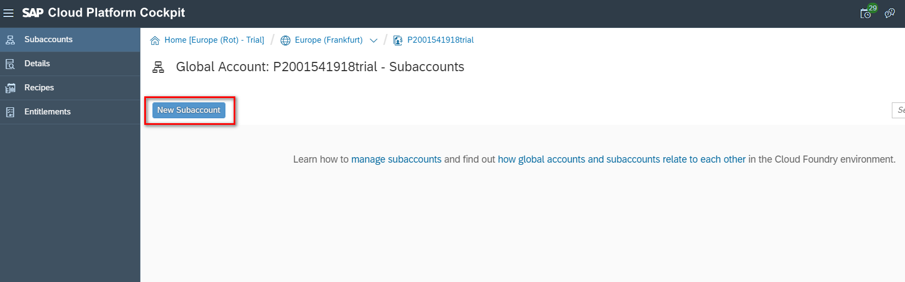    
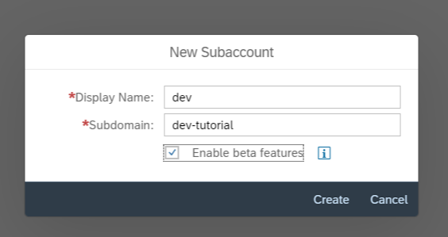    
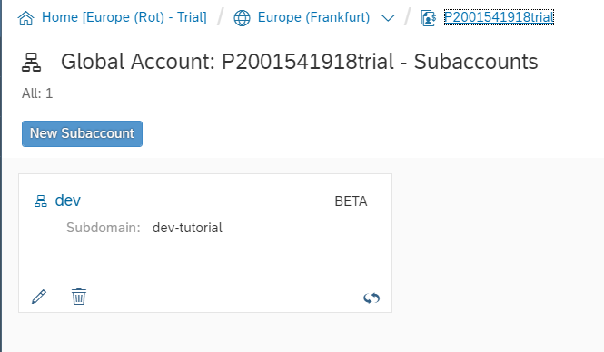    

#### 6.激活Cloud Foundry账户，创建Space
进入cf subaccount, 激活Cloud Foundry账户
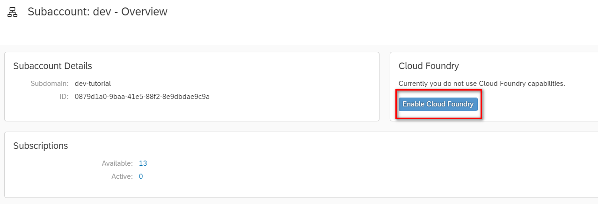    
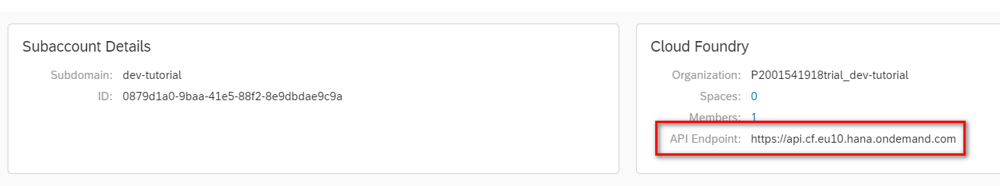  

创建Space
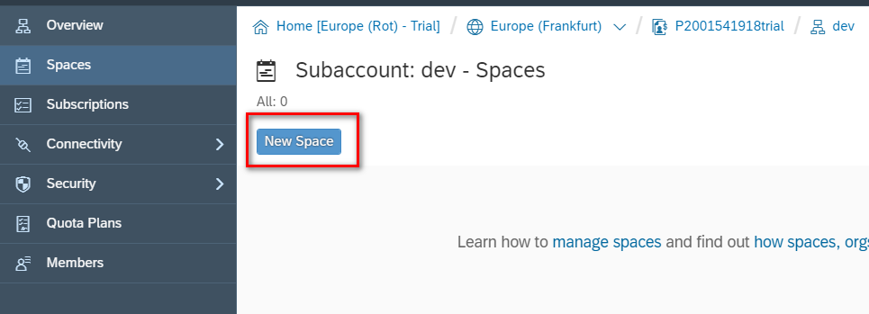    
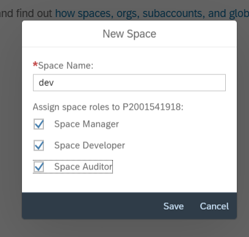    
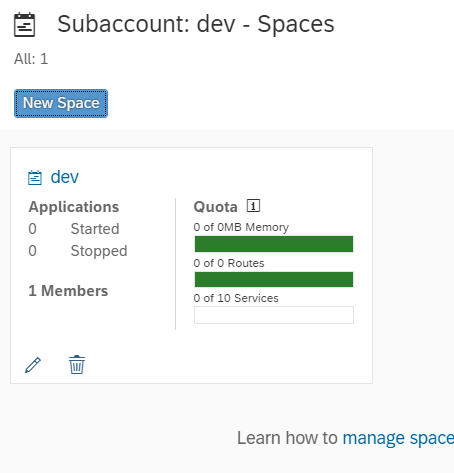    

#### 7.分配资源：Subaccount和Space
为subaccount分配资源,点击global account,进入Entitlements里面分配资源。
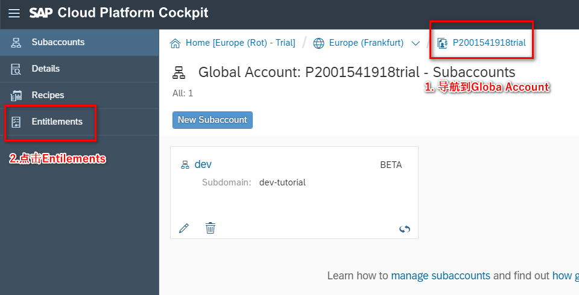
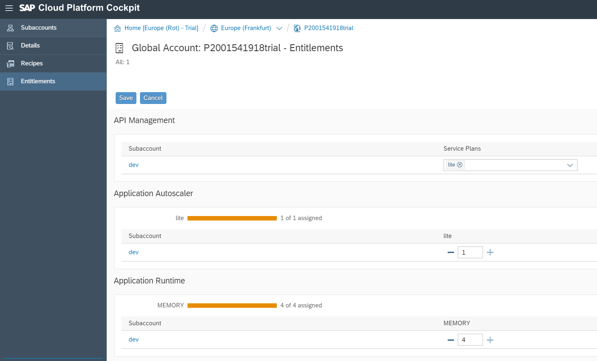    
基础资源分配表：
- API Management
- Application Runtime  
- Connectivity  

其余资源按需分配。

为space分配资源,按照自己需求分配给space,这个练习中，我们将所有资源都分配给dev Space.
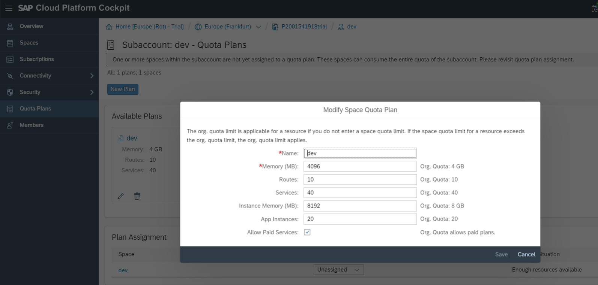    
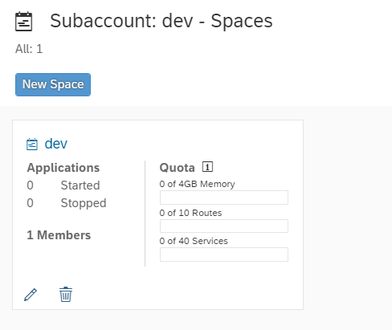    
