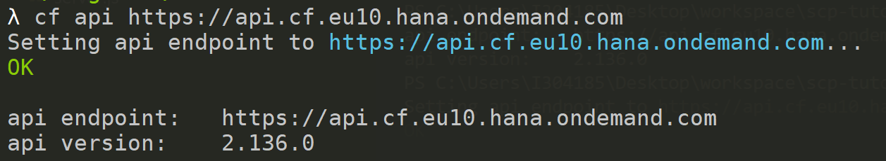
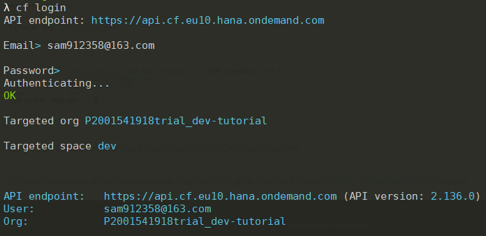

<!-- TOC -->

- [配置Cloud Foundry的使用环境，使用命令行操作CF账户。](#%E9%85%8D%E7%BD%AECloud-Foundry%E7%9A%84%E4%BD%BF%E7%94%A8%E7%8E%AF%E5%A2%83%E4%BD%BF%E7%94%A8%E5%91%BD%E4%BB%A4%E8%A1%8C%E6%93%8D%E4%BD%9CCF%E8%B4%A6%E6%88%B7)
  - [1.下载并安装CF命令行](#1%E4%B8%8B%E8%BD%BD%E5%B9%B6%E5%AE%89%E8%A3%85CF%E5%91%BD%E4%BB%A4%E8%A1%8C)
  - [2. 通过CLI连接到Cloud Region](#2-%E9%80%9A%E8%BF%87CLI%E8%BF%9E%E6%8E%A5%E5%88%B0Cloud-Region)
  - [3. 使用CLI登陆](#3-%E4%BD%BF%E7%94%A8CLI%E7%99%BB%E9%99%86)

<!-- /TOC -->
## 配置Cloud Foundry的使用环境，使用命令行操作CF账户。
### 1.下载并安装CF命令行
从Cloud Foundry网站下载最新的命令行界面（CLI）。 使用以下URL：https：//github.com/cloudfoundry/cli#downloads。

在Cloud Foundry网站上，选择命令行安装程序（如果设置为使用一个）或下表中的二进制文件。 如果您不知道使用哪个，请从表中选择操作系统的安装程序（而不是二进制文件）。

在计算机上打开安装程序，然后按照安装说明进行操作。
>注意：有关CLI安装的更多帮助，请查看Cloud Foundry CLI安装文档。


Installers and compressed binaries
 
| | Mac OS X 64 bit | Windows 64 bit | Linux 64 bit |
| :---------------: | :---------------: |:---------------:| :------------:|
| Installers | [pkg](https://packages.cloudfoundry.org/stable?release=macosx64&source=github) | [zip](https://packages.cloudfoundry.org/stable?release=windows64&source=github) | [rpm](https://packages.cloudfoundry.org/stable?release=redhat64&source=github) / [deb](https://packages.cloudfoundry.org/stable?release=debian64&source=github) |
| Binaries | [tgz](https://packages.cloudfoundry.org/stable?release=macosx64-binary&source=github) | [zip](https://packages.cloudfoundry.org/stable?release=windows64-exe&source=github) | [tgz](https://packages.cloudfoundry.org/stable?release=linux64-binary&source=github) |


### 2. 通过CLI连接到Cloud Region
首先，找到您所在地区的正确API网址。 从此表中选择正确的区域。可以在CF Space里面查到自己的API point. 

|Region|	URL|  
|---|---|  
|US East (VA) running on AWS | https://api.cf.us10.hana.ondemand.com |  
|US West (CA) running on Azure | https://api.cf.us20.hana.ondemand.com |  
|Europe (Frankfurt) running on AWS | https://api.cf.eu10.hana.ondemand.com |

接下来，在您的计算机上打开命令行提示符。在命令行屏幕中，输入以下内容:
```
cf api [Region URL]
```


### 3. 使用CLI登陆
在相同的命令提示符（从上一步）中输入以下命令：
```
cf login
```
出现提示时，输入您的用户名和密码。 登录后，您应该会看到屏幕截图中显示的API端点，用户，组织和空间。


您现在已设置为在SAP Cloud Platform上使用Cloud Foundry系统。

----
有关命令行界面（CLI）的更多信息，请转至CLI[网站的Cloud Foundry](http://docs.cloudfoundry.org/cf-cli/getting-started.html)入门
