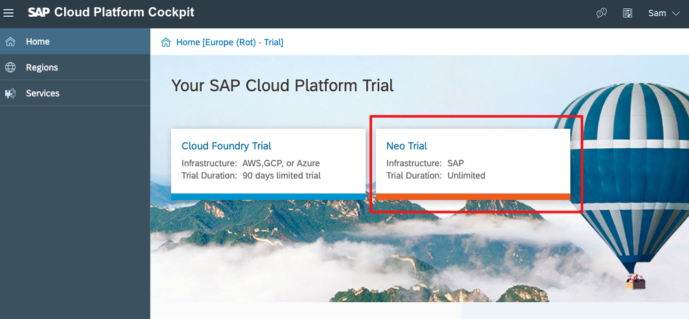
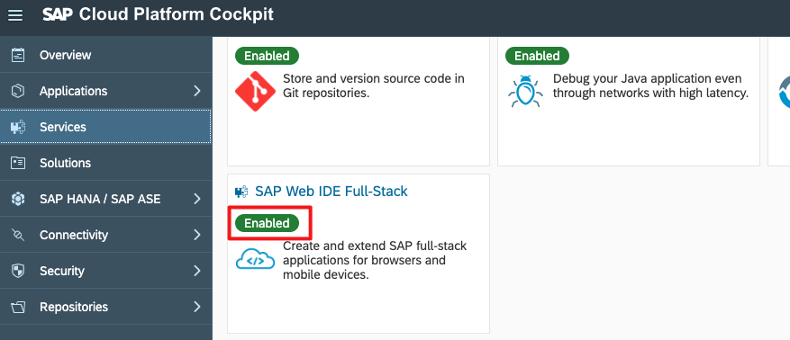
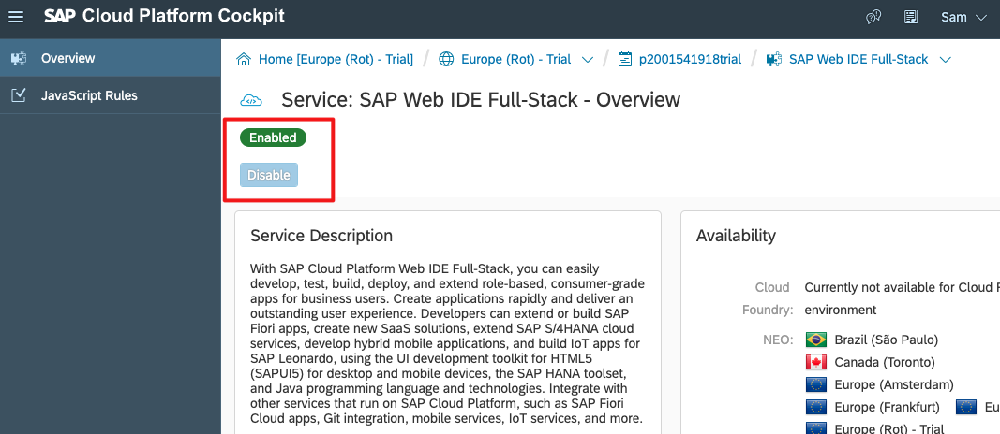
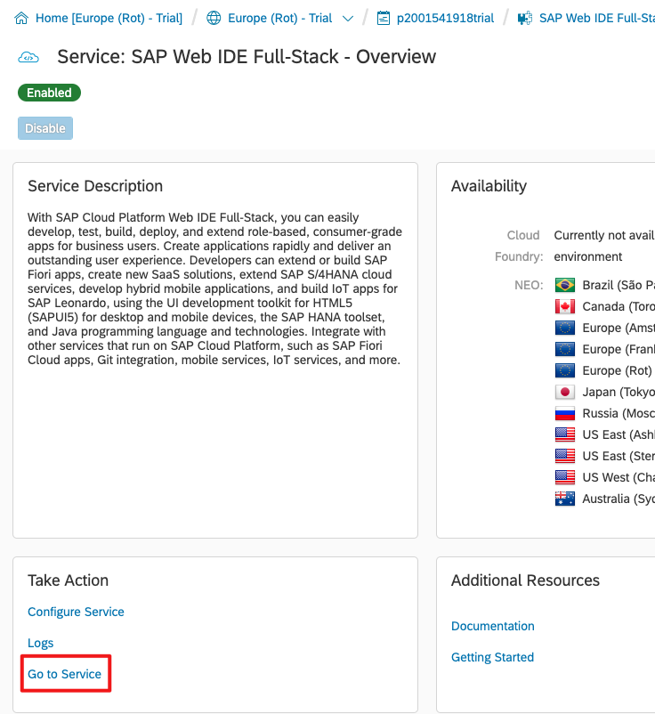
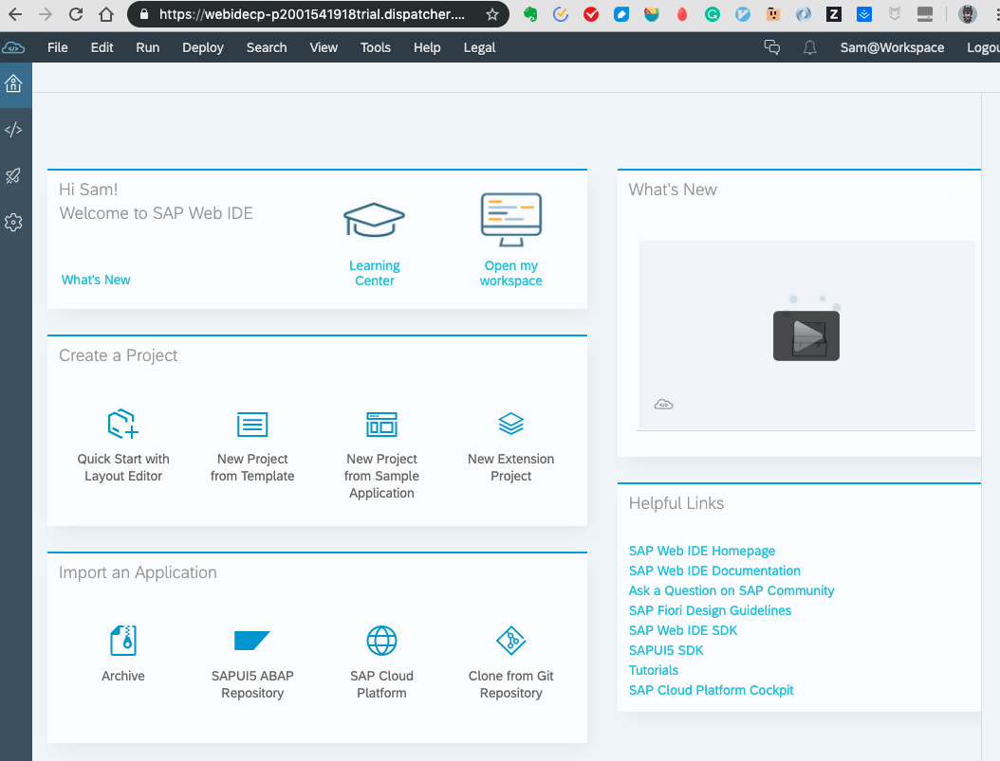
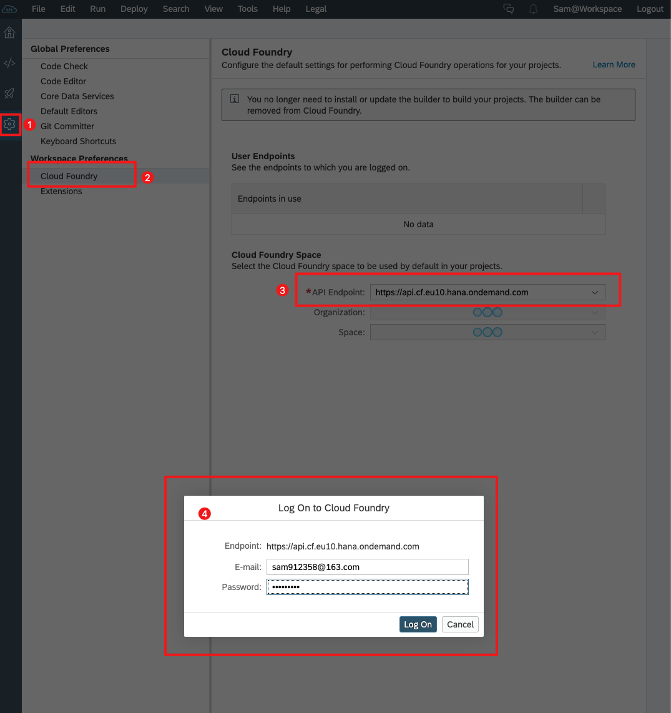
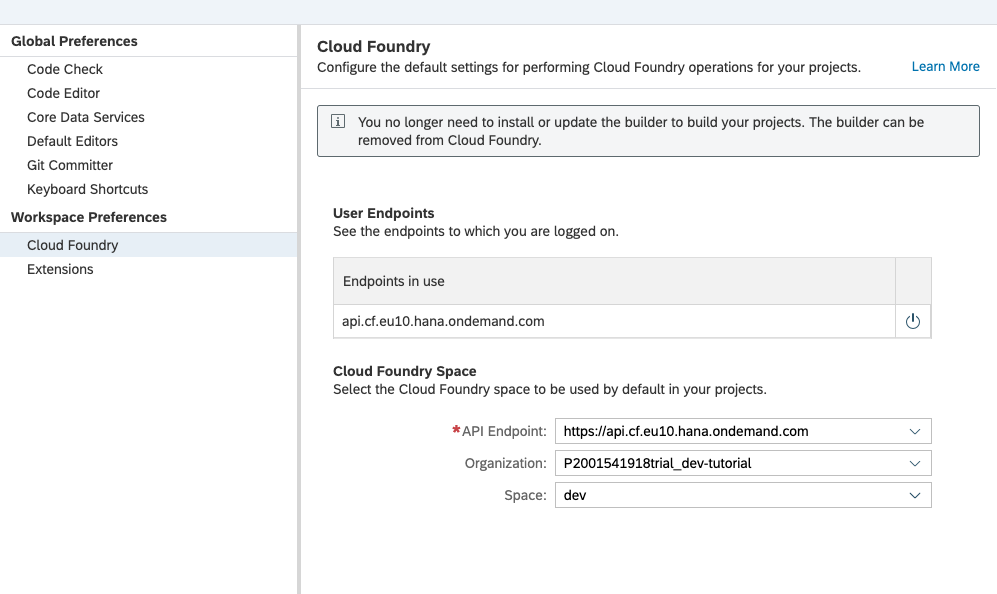

# 为Cloud Foundry Development准备SAP Web IDE
在SAP Cloud Platform中启用并打开SAP Web IDE Full-Stack，并配置要部署的CF API端点。

## 1. 打开你的SAP Cloud Platform账户
 打开您的SAP Cloud Platform帐户（如果您有免费的开发人员帐户，请单击此处打开[cockpit](https://account.hanatrial.ondemand.com/cockpit)）。
选择Neo Trial账户，

>登录时遇到问题？ 如果您在登录SAP Cloud Platform Cockpit时遇到问题，并且您使用的是公司帐户（由您的雇主提供），则可能是云访问已被锁定。 点击上面的链接创建一个新的免费试用帐户，然后使用您的个人电子邮件地址设置新帐户。

## 2. 进入Services
您现在应该位于SAP Cloud Platform Cockpit中，如下所示。 单击左侧的“Service”菜单项。

接下来，单击SAP Web IDE Full-Stack框,并且点击`Enable`按钮，激活WebIDE。

## 打开Web IDE Full-Stack
在WebIDE的界面，底部有一个`Go to Service`按钮，进入到WebIDE页面。

## 设置Cloud Foundry的配置
1. 单击左侧栏中的齿轮图标以打开设置菜单。 
2. 然后，选择Cloud Foundry设置。
3. 根据子帐户所在的数据中心选择API point。 单击下拉控件，将向您建议最常见的端点。 您可以在帮助门户中查看所有端点的列表。 
4. 系统可能会提示您输入Cloud Foundry身份信息。 输入您用于SAP Cloud Cockpit的身份信息。

您还可以在项目设置中为每个项目选择特定的API端点。

>Cloud Foundry的账户注册请参考[01-get-trial-account](https://github.com/milkdeliver/scp-tutorial/blob/master/01-get-trial-account/get-a-free-trial-account-on-SAP-cloud-platform.md)