## C4C与微信集成处理用户ticket
本文档为您提供了一个基于B2B服务集成方案将SAP Cloud for Customer（C4C）租户与微信连接的示例

### 集成背景介绍
假设您的公司需要与业务客户打交道。 商业客户可以将微信帐户与客户联系人关联，然后直接从微信创建Cloud for Customer服务票证。 他们可以通过微信与服务代理进行关于他们创建的票证的异步社交互动。 您的服务代理还可以对Cloud for Customer服务票证进行异步响应。 C4C代理服务器加速器项目实现了5个功能来完成整个方案：
1. 将微信用户与C4C联系人相关联，这意味着：
  - 通过微信openID创建SocialMediaUserProfile（SMUP）
  - SMUP与联系人作为BusinessPartner（BP）关联，这意味着该联系人作为子节点“ SocialMediaUserProfileBupaReference”存储在根节点“ SocialMediaUserProfile”中
2. 通过微信创建票证，这意味着：
  - SociaMediaActivity（SMA）已创建。
3. 检查故障单列表和故障单详细信息
4. 检查有关票证的社交互动
5. 通过微信发送和接收有关门票的消息
6. 从C4C检索调查消息和链接

### 集成准备工作
1. WeChat的企业号或者订阅者账号，个人账号不适合。如果都没有，可以申请一个测试账号用于测试使用。
2. C4C账号
3. SAP Cloud Platform账号，可以申请一个Trial account用于测试

## 开发集成
### C4C
#### 在C4C一端建立Mashup通道用于之后跟Wechat通信的Tunnal
第一步：新建一个Mashup用于通信
打开C4C --> Adminstrator -> Mashup Web Service
1. 新建一个心的mashup，参数设置按照图所示。
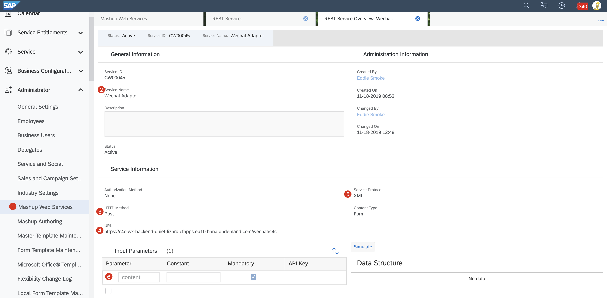
>此时url是指我们用于承接请求的`Agent Server`的地址。因为还没有部署，所以这个地址可以先随意填一个。

在此我们可以先得到 Mashup的`Service ID`，先记下。

第二步：新建一个Social Medium的Channel,绑定Mashup `Serive ID`.
1. 打开C4C --> Adminstrator -> Service and Social -> Social Media -> Social Media Channel
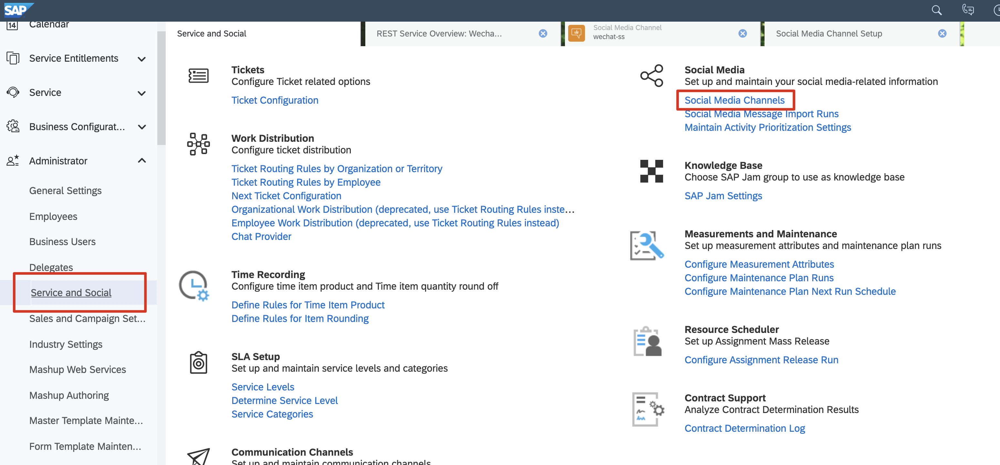

2. 新建一个Channel
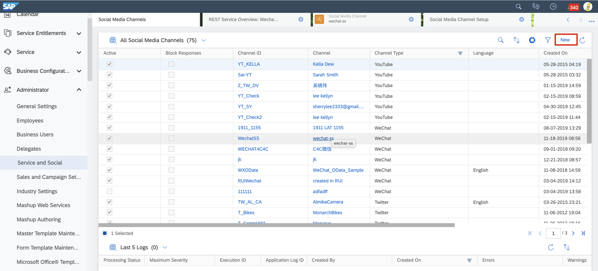
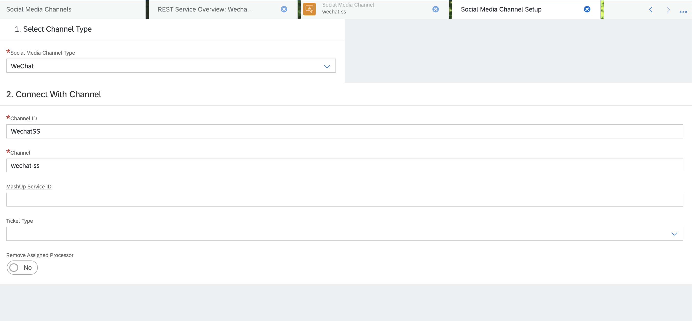
Social Media Channel Type: Wechat
ChannelID: <WechatSS>
Channel: <wechat-ss>
MashUp Service ID: <第一步创建maIDup的ServiceID>

3. 保存退出
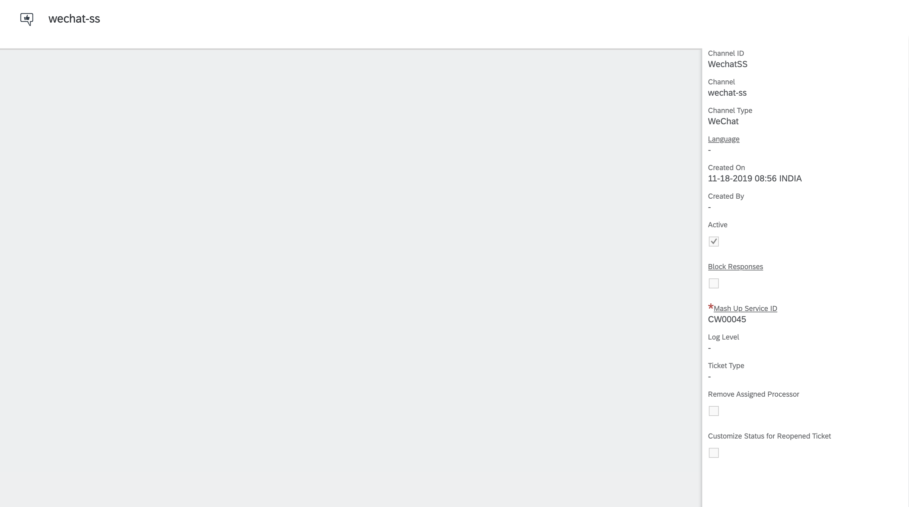

目前关于Social Media的要做的工作已经完成，记住目前还有一个Mashup上面的那个URL还没有填好。

#### 在C4C端，建立用于通信的用户组
在这个用户组里面的客户才可以使用wechat channel用于通信。  
第一步：新建用户组和用户
1. Customer -> Account -> Create
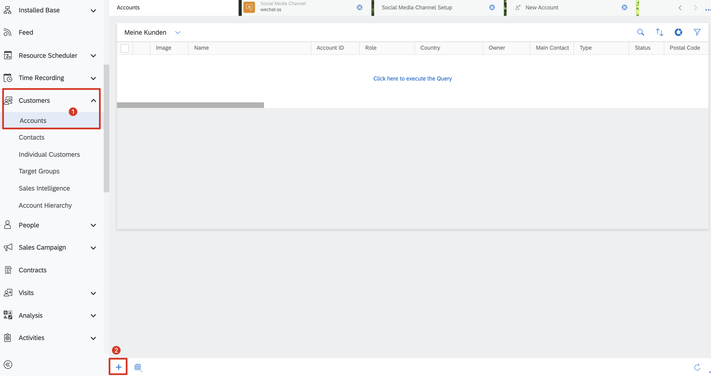


2. Account -> Contacts 
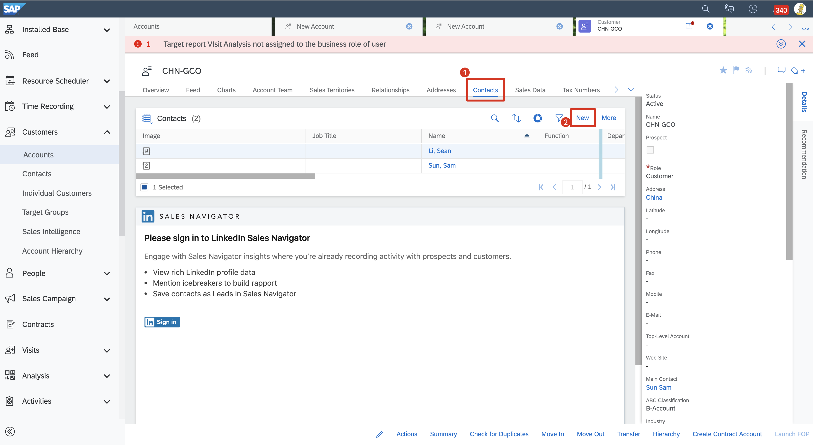

>这里的用户的电话号码用于验证，请填写正确的信息。

### 微信端
#### 申请账号
进入微信的官方网站 https://mp.weixin.qq.com/，点击订阅号，进入开发文档
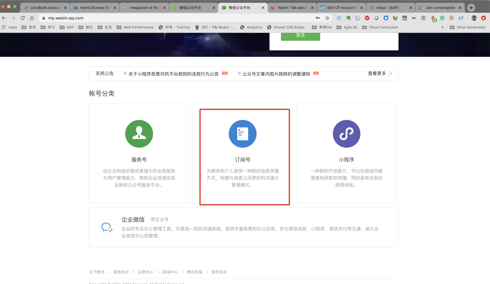
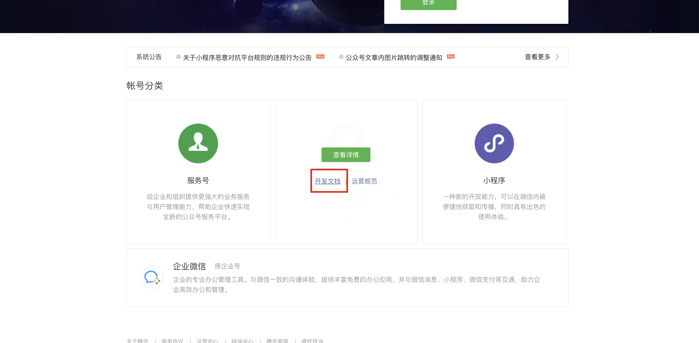

进入文档，申请开发者测试账号，如果已经有了正式账号请选择正式账号使用。
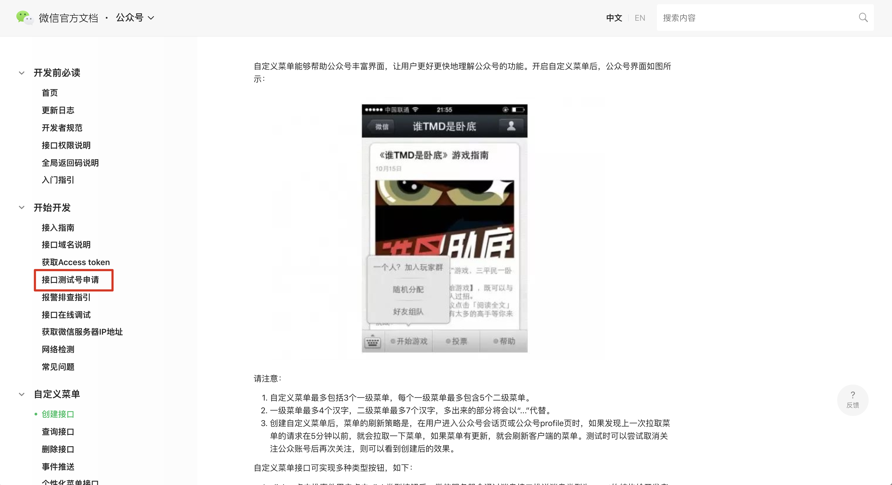

申请好了之后，进入账号信息页面。
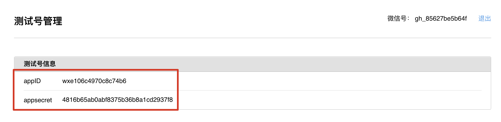

在账户的页面下面，有两个关键信息，appID和appsecret,这两个信息用于跟wechat交互的身份信息，保存好。

### Agent Server
在Agent Server端，所有的跟微信和C4C交互动作都在此完成

请查看有我们成都研究院的同事设计开发出来一套Agent Server，用于PoC阶段的验证。
git: https://github.com/kellynlee/C4CODataSampleCode

第一步：下载代码
git clone https://github.com/kellynlee/C4CODataSampleCode


第二步：修改Back-end和Font-End文件下面的基础配置
1. Back-End/config/server.config.js
```javascript
// C4C address
const proxyUrl = "https://my306768.vlab.sapbydesign.com/sap/c4c/odata/v1/c4codataapi/";

// CF app address
const host = 'https://c4c-wx-backend-quiet-lizard.cfapps.eu10.hana.ondemand.com';

// C4C user password
const authorization = {
    Username: "<username>",
    Password: "<password>"
};

// Channel ID
const codeCollection = {
    typeCode: '1607',
    providerID:'WechatSS', //TODO: Channel ID
    SMUPCategoryCode: '02',
    SMACategoryCode: '001',
    ResponseCategoryCode: '003',
    roleCode: 'BUP001',
    BPCategoryCode: '1',
    wxChannelCode: '008',
    SocialMediaChannelCode: '001',
    InitiatorCode: '2',
    InitiatorReplyCode: '1'
};

// wechat Template Key
const templateCollection = {
    ticketNotification: '3fTc7rji2UNiCeSSmJS-8bQ2omaScofgYId4hYNKnek',
    socialInteractionNotification:'vhlvg_V3IwKXgd38TM2VhV8d8M0Z2x7tmsz68D3yZvQ',
    surveyNotification: 'Zs6DFiToLOErd9_tMn2zETXU7nDVPV9KLX-E2mBCvS8'
}

```

2. Back-End/config/wechatConfig.js ,修改appid
```javascript
const webAuthRedirectUrl = "https://open.weixin.qq.com/connect/oauth2/authorize?appid=wxe106c4970c8c74b6&redirect_uri=";
const validationToken = 'test-for-token';
```

3. Front-End/config/api.config.js,修改Host地址
```javascript
const isPrd = Object.is(process.env.NODE_ENV, 'production');
const HOST = isPrd ? 'https://c4c-wx-backend-quiet-lizard.cfapps.eu10.hana.ondemand.com' : 'http://localhost:4000';
module.exports = {
    baseUrl: isPrd ? 'https://c4c-wx-backend-quiet-lizard.cfapps.eu10.hana.ondemand.com' : 'api/',
    url: URL
}
```

第三步： build Front-End代码复制到Back-End中  
```bash
i304185@C02Z168NLVDQ:~/Desktop/workspace/sap/C4CODataSampleCode$ cd Front-End/i304185@C02Z168NLVDQ:~/Desktop/workspace/sap/C4CODataSampleCode/Front-End$ npm run-script build -production
```
编译好Front-End的代码之后，将/distx 下面的文件全部复制到Back-End views文件夹下面，覆盖之前的版本。
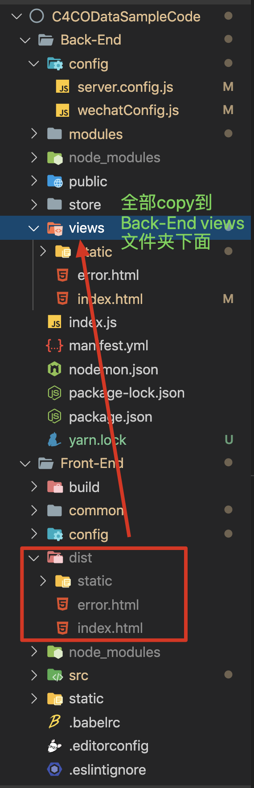

第四步： 部署Back-End到CF环境里面
如何部署查看 [get-start-with-cloud-foundry](https://github.com/milkdeliver/scp-tutorial/blob/master/02-get-start-with-cloud-foundry/get-start-with-cloud-foundry.md)和[create-deploy-nodejs-app](https://github.com/milkdeliver/scp-tutorial/blob/master/03-create-deploy-nodejs-app/create-deploy-nodejs-app.md)
```yaml
---
applications:
- name: c4c-wx-backend 
  random-route: true
  path: Back-End
  memory: 512M
  routes:
  - route: c4c-wx-backend-quiet-lizard.cfapps.eu10.hana.ondemand.com
```

部署之后在cockpit里面查看app,部署好的app。
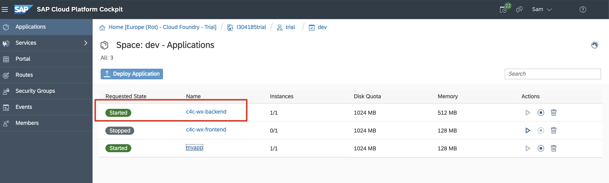


* <>,尖括号里面表示这是个变量，自己随意设置


